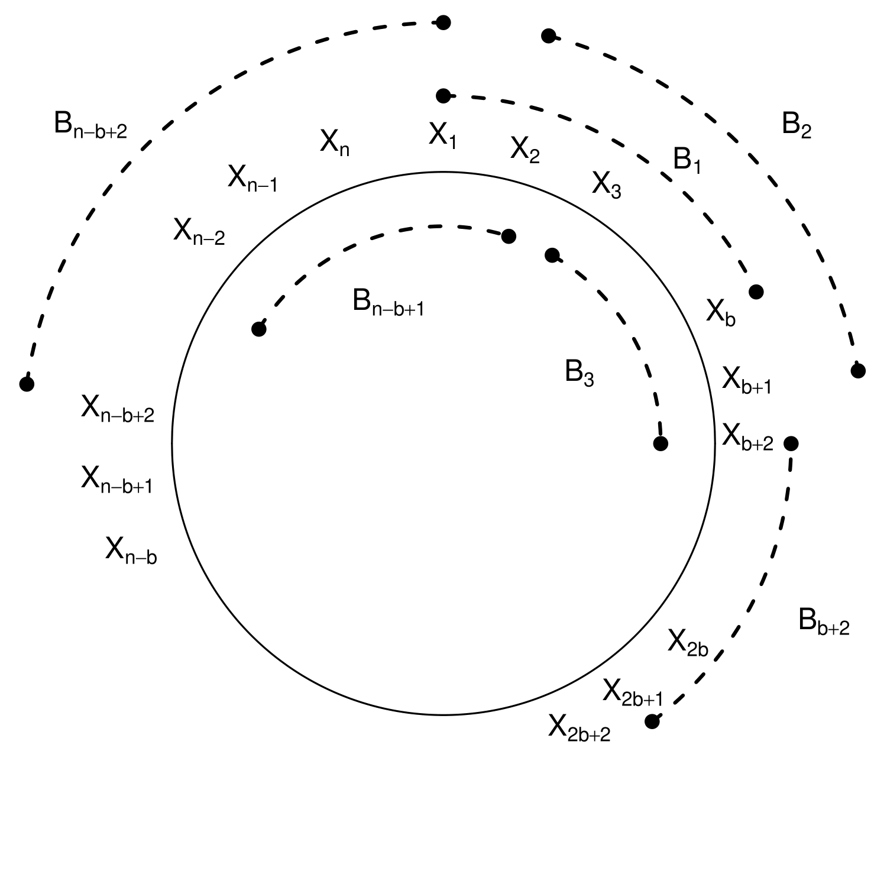

```{r, setup, include=FALSE}
knitr::opts_knit$set(root.dir = '/home/tucker/Documents/GitHub/BEwebinar/Data')
```

# Lesson 12-8: Block Bootstrap

- We now look at *block bootstrap methods*, which is similar in spirit to subsampling.
- We take sub-spans of the time series, and then patch them together to generate a synthetic time series that functions as our pseudo-sample.

## Paradigm 12.8.2. Block Bootstrap for the Sample Mean

- Suppose we have a stationary time series $\{ X_t \}$.
- Suppose $\theta$ is the mean, and $\widehat{\theta}$ is the sample mean. Then
\[
  J_n (x) = {\mathbb P} [ \sqrt{n} (\widehat{\theta} - \theta) \leq x] \rightarrow J(x),
\]
 where $J(x) = \Phi (x/\sigma_{\infty})$.
- Let $b$ be small relative to $n$, as in the subsampling method.
- Divide the sample into $Q = n-b+1$ overlapping blocks.
- We want to construct a length $n$ pseudo-sample from length $b$ blocks, so we require $k = n/b$ such blocks.
- Idea: randomly draw from the $Q$ blocks, and then paste them together!
- Denote those $Q$ blocks of random variables as $B_1, \ldots, B_Q$.

1. For $1 \leq j \leq M$, draw $B_1^{*(j)}, \ldots, B_k^{*(j)}$ randomly (with replacement) from the set of available blocks $B_1, \ldots, B_Q$.
2. Concatenate for each $j$ those draws, obtaining the $j$th pseudo-series $X_1^{*(j)}, \ldots, X_n^{*(j)}$.
3. Compute the statistic on each pseudo-series, denoted $\widehat{\theta}_n^{*(j)}$.
4. We estimate $J_n (x)$ with
\[
  \frac{1}{M} \sum_{j=1}^M 1_{ \{ \sqrt{n} (\widehat{\theta}_n^{*(j)} - \widehat{\theta}_n ) \leq x \} }.
\]

- Just like subsampling, we insert $\widehat{\theta}_n$ for $\theta$.
- There is a variant called the *tapered block bootstrap*, where observations at the edge of a block $B_k$ get down-weighted.

## Exercise 12.33.  Block Bootstrap for the Mauna Loa Mean

- Consider annual differences of the logged Mauna Loa CO2 time series.
- We want to estimate the mean using block bootstrap. So we apply the above method to obtain the cdf of the centered statistic.

```{r}
mau <- read.table("mauna.dat",header=TRUE,sep="")
mau <- ts(mau,start=1958,frequency=12)
mau.gr <- 1000*diff(log(mau),lag=12)
n <- length(mau.gr)
mau.mean <- mean(mau.gr)
```

- The sample mean (after rescaling) is `r mau.mean`.
- First try $b = \sqrt{n}$ and $M = 10^5$.
- We can also try $b = n^{1/3}$ and $b = n^{2/3}$ by rerunning the code chunk.

```{r}
# Make choice of b, and then run 
b <- ceiling(sqrt(n))
#b <- ceiling(n^(1/3))
#b <- ceiling(n^(2/3))

k <- ceiling(n/b)
Q.big <- n - b + 1
monte.roots <- NULL
Monte <- 100000
for(i in 1:Monte)
{
	monte.sample <- NULL
	for(j in 1:k)
	{
		boot.index <- sample(Q.big,size=1)
		monte.sample <- c(monte.sample,mau.gr[seq(boot.index,boot.index+b-1)])
	}
	monte.sample <- monte.sample[1:n]
      monte.root <- mean(monte.sample) - mau.mean
	monte.roots <- c(monte.roots,monte.root)
}
interval <- c(sort(monte.roots)[floor(.025*Monte)],sort(monte.roots)[floor(.975*Monte)])
```

- The $95 \%$ confidence interval based on the bootstrap is [`r mau.mean - interval[2]`,`r mau.mean - interval[1]`].
- We plot the bootstrap edf.

```{r}
plot(sort(monte.roots),seq(1,Monte)/Monte,type="l",xlab="x",ylab="",lwd=2)
```




## Remark 12.8.5.  Circular Block Bootstrap
 
- In the figure, we display the idea of wrapping our sample $X_1, \ldots, X_n$ around a circle, and selecting overlapping blocks on the circle. 
- This yields blocks $B_1, \ldots, B_n$, where the extra blocks $B_{Q+1}, \ldots, B_n$ share portions of the beginning and end of the sample.
- Is this valid? By stationarity, one part of a time series is as good as another!
- The resulting block bootstrap is called the *circular block bootstrap*. It correctly centers the bootstrap of the sample mean.

## Paradigm 12.8.6. The Generalized Block Bootstrap

- Consider a block bootstrap where the block size $b$ is random, i.e., there is a discrete random variable $R$ that generates the block size.
- For example, $R$ could be Poisson plus one.

```{r}
r.block <- 1 + rpois(10,lambda =3)
print(r.block)
```

- This gives us some variation in block size. The procedure is called the *generalized block bootstrap*.
- The algorithm is like that of Paradigm 12.8.2, but replace the first two steps as follows:

1. For $1 \leq j \leq M$, randomly draw indices $U_1^{(j)}, U_2^{(j)}, \ldots \sim \mbox{i.i.d.} \mbox{Uniform} \{ 1, 2, \ldots, n\}$, and randomly draw block sizes $V_1^{(j)}, V_2^{(j)}, \ldots \sim \mbox{i.i.d.} R$. Then set 
\[
  B_i^{*(j)} = \{ X_{U_i^{(j)}}, X_{U_i^{(j)}+1}, \ldots, X_{U_i^{(j)} + V_i^{(j)} -1} \},
\]
for $i = 1, 2, \ldots$. We proceed until we reach $k$ such that $\sum_{i=1}^k V_i^{(j)} \geq n$.  
2. Concatenate for each $j$ those draws, obtaining the $j$th pseudo-series $X_1^{*(j)}, \ldots, X_n^{*(j)}$ from $B_1^{*(j)}, B_2^{*(j)}, \ldots, B_k^{*(j)}$.

- The $U$ random variables tell us where the block starts, and the $V$ random variables tell us the size of the block.
- In constructing the blocks, we wrap around the circle, as in the circular block bootstrap.
- We only need to draw random variables $V$ until the total length is at least $n$. If ${\mathbb P} [ V = 0] = 0$, then the number $k$ of random variables needed will be finite.
- The last block $B_k^{*(j)}$ could make our pseudo-series have length greater than $n$, in which case we just trim off the extra.
- Special case: ${\mathbb P}[ V = b] = 1$ corresponds to regular circular block bootstrap.

## Remark 12.8.7. The Stationary Bootstrap

- Suppose we take a generalized block bootstrap with $R$ a Geometric distribution of parameter $p_n$.

```{r}
r.block <- rgeom(10,prob=.5)
print(r.block)
```

- This can generate zero values, which amounts to just skipping that block (it would have length zero).
- With this choice, the sample paths of the pseudo-series are strictly stationary in the bootstrap world (i.e., conditional on the sample)!
- The expected block size is $1/p_n$.
- So we should choose $p_n \rightarrow 0$, but we also want $n p_n \rightarrow \infty$.

## Exercise 12.35.  Stationary Bootstrap for the Mauna Loa Mean

- Again consider annual differences of the logged Mauna Loa CO2 time series.
- We want to estimate the mean using the stationary bootstrap. So we apply the above method to obtain the cdf of the centered statistic.

```{r}
mau <- read.table("mauna.dat",header=TRUE,sep="")
mau <- ts(mau,start=1958,frequency=12)
mau.gr <- 1000*diff(log(mau),lag=12)
n <- length(mau.gr)
mau.mean <- mean(mau.gr)
```

- The sample mean (after rescaling) is `r mau.mean`.
- First try $p_n = 1/\sqrt{n}$ and $M = 10^5$.
- We can also try $p_n = n^{-1/3}$ by rerunning the code chunk.

```{r}
# Make choice of p.geo, and then run 
p.geo <-  1/sqrt(n)
# p.geo <-  n^{-1/3}

monte.roots <- NULL
Monte <- 100000
for(i in 1:Monte)
{
	tot.len <- 0
	monte.sample <- NULL
	while(tot.len < n)
	{
		boot.index <- sample(n,size=1)
		boot.size <- rgeom(1,prob=p.geo)
		if(boot.size>0)
		{
			boot.size <- min(boot.size,n)
			monte.index <- seq(boot.index,boot.index+boot.size-1)
			monte.index <- union(monte.index[monte.index <= n],monte.index[monte.index > n] %% n)
			boot.sample <- mau.gr[monte.index]
			monte.sample <- c(monte.sample,boot.sample)
		}
		tot.len <- tot.len + boot.size
	}
      monte.root <- mean(monte.sample) - mau.mean
	monte.roots <- c(monte.roots,monte.root)
}
interval <- c(sort(monte.roots)[floor(.025*Monte)],sort(monte.roots)[floor(.975*Monte)])
```

- The $95 \%$ confidence interval based on the bootstrap is [`r mau.mean - interval[2]`,`r mau.mean - interval[1]`].
- We plot the bootstrap edf.

```{r}
plot(sort(monte.roots),seq(1,Monte)/Monte,type="l",xlab="x",ylab="",lwd=2)
```

